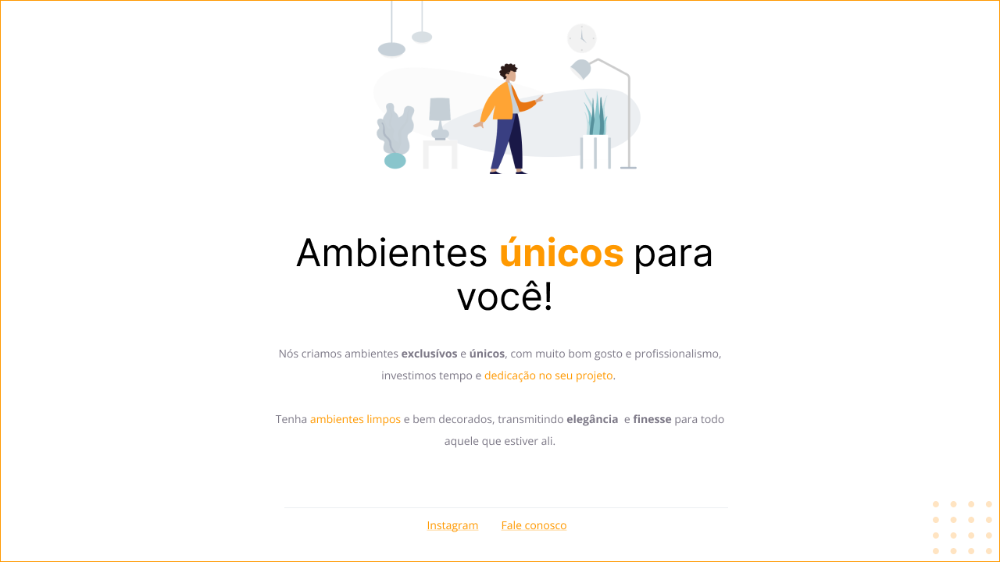

<h1 align="center"> Explorer Challenges - "Móveis Customizados"</h1>

Desafio do Stage 02 do Programa Explorer da Rocketseat

  <a href="#-tecnologias">Tecnologias</a>&nbsp;&nbsp;&nbsp;|&nbsp;&nbsp;&nbsp;
  <a href="#-projeto">Projeto</a>&nbsp;&nbsp;&nbsp;|&nbsp;&nbsp;&nbsp;
  <a href="#clock1-planos-futuros">Planos Futuros</a>&nbsp;&nbsp;&nbsp;|&nbsp;&nbsp;&nbsp;
  <a href="#memo-licença">Licença</a>

  

 

  

## 🚀 Tecnologias

- Esse projeto foi desenvolvido com as seguintes tecnologias:

  - HTML
  - CSS

## 💻 Projeto

- O Projeto "Móveis Customizados" consiste em uma land page simples desenvolvida logo após as primeiras aulas de introdução ao HTML e CSS.

- O Objetivo deste exercicio é reparar um código quebrado com base em um layout do figma.

## 🕐 Planos Futuros

- Utilizar o projeto como objeto de estudo e implementar novos conceitos aprendidos durante as aulas do bootcamp, de maneira que façam sentido para o código.

## 📝 Licença

- Esse projeto está sob a licença MIT.

---

🚀 Feito com ❤️ por Vitor Sousa 🚀
